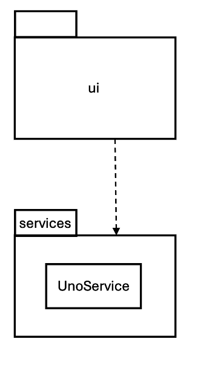
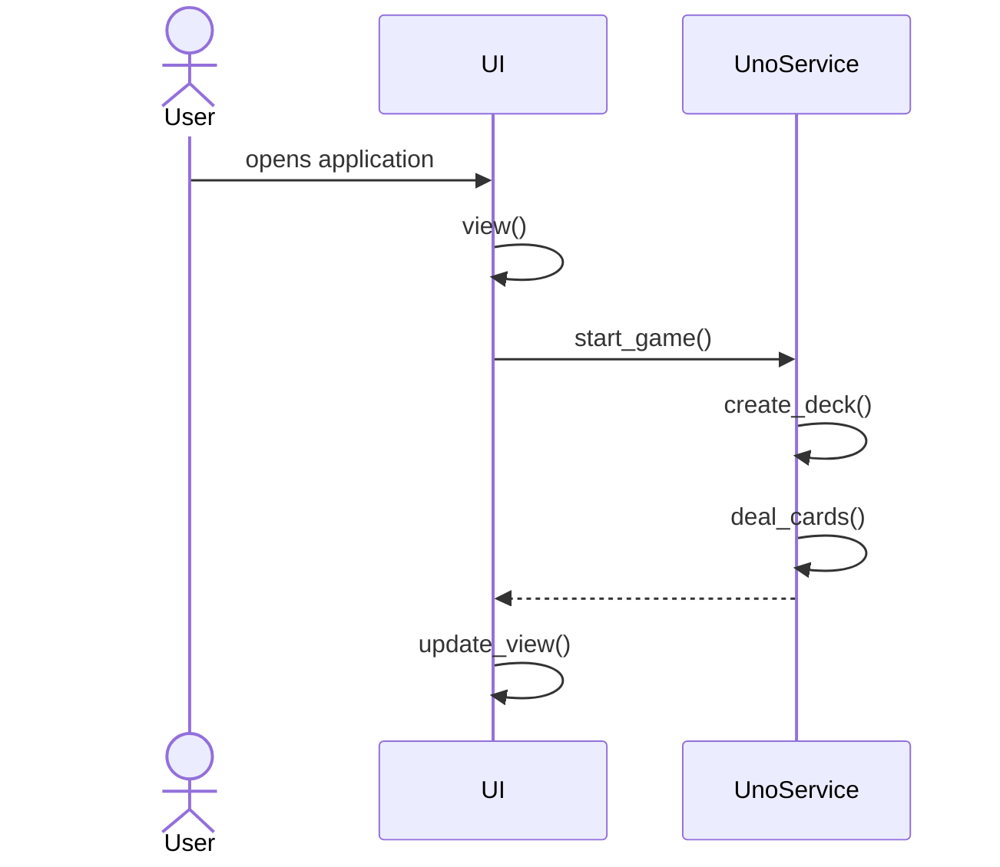
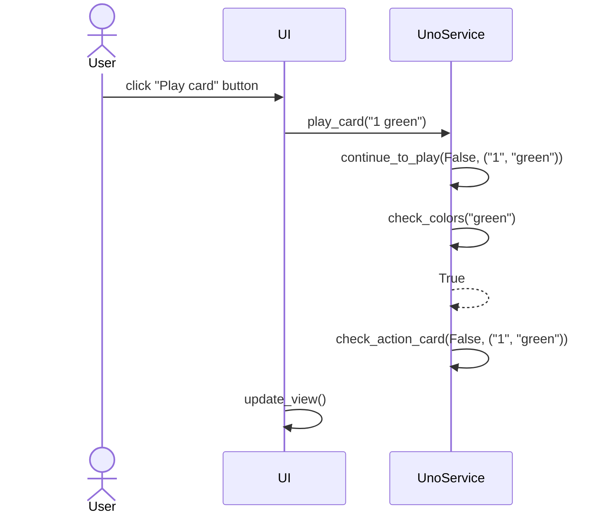
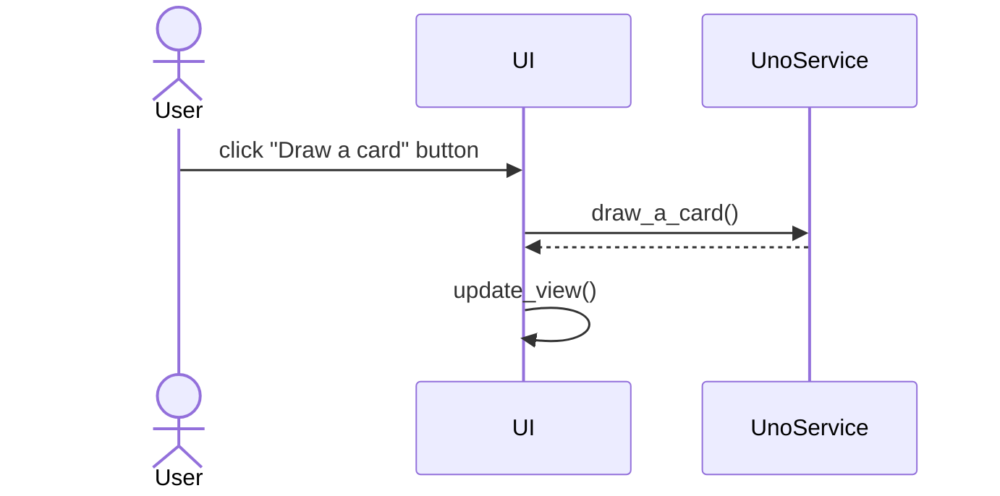
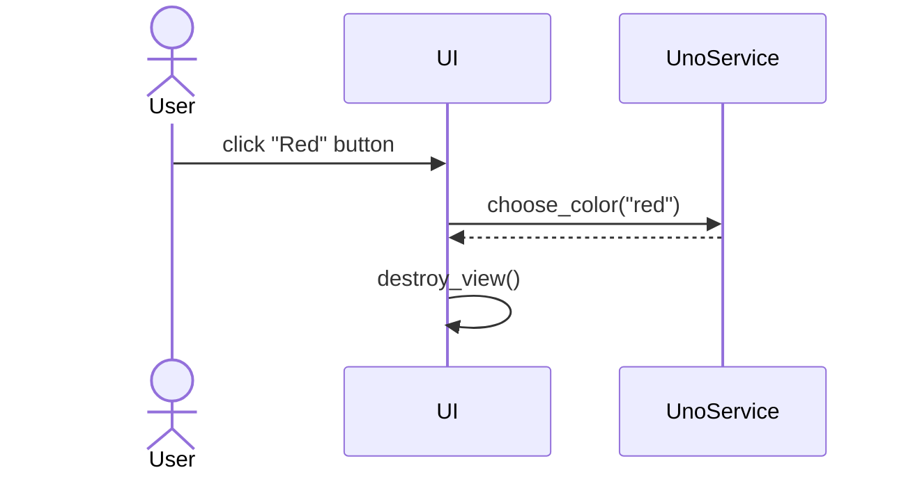

# Arkkitehtuurikuvaus

Luokka/pakkauskaavio:

## Päätoiminnallisuudet

Sekvenssikaavioina kuvattu pelissä olevia toimintoja.

### Pelin aloittaminen

### Kortin pelaaminen

### Kortin nostaminen

### Värin valitseminen

