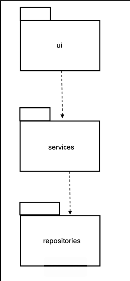
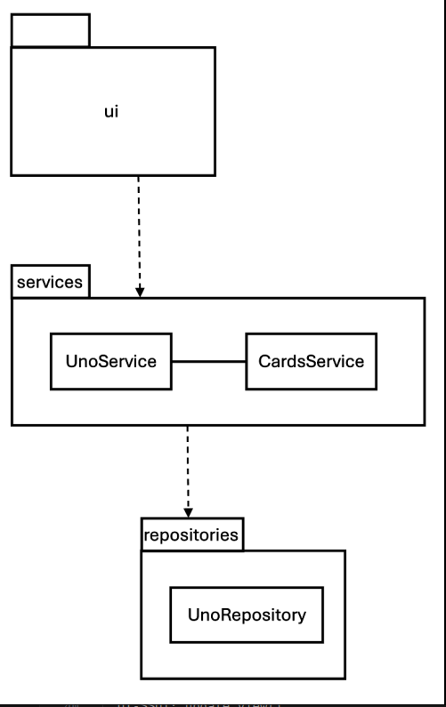
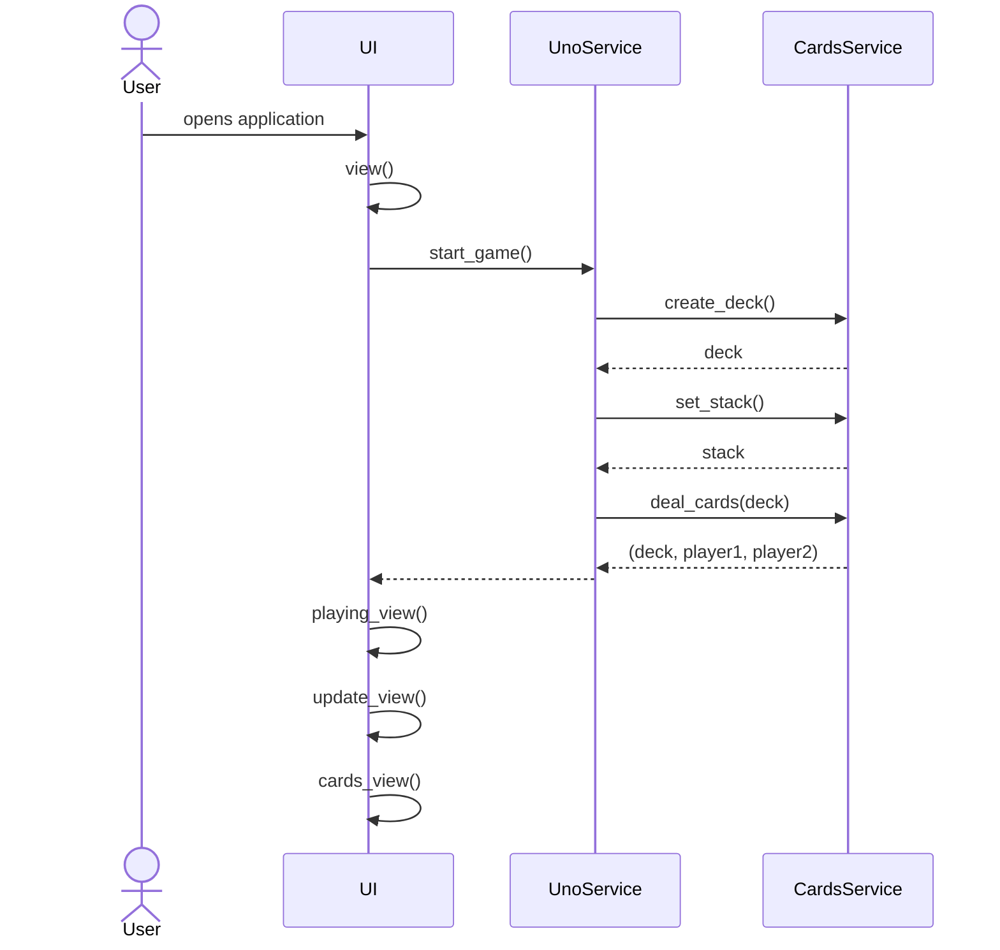
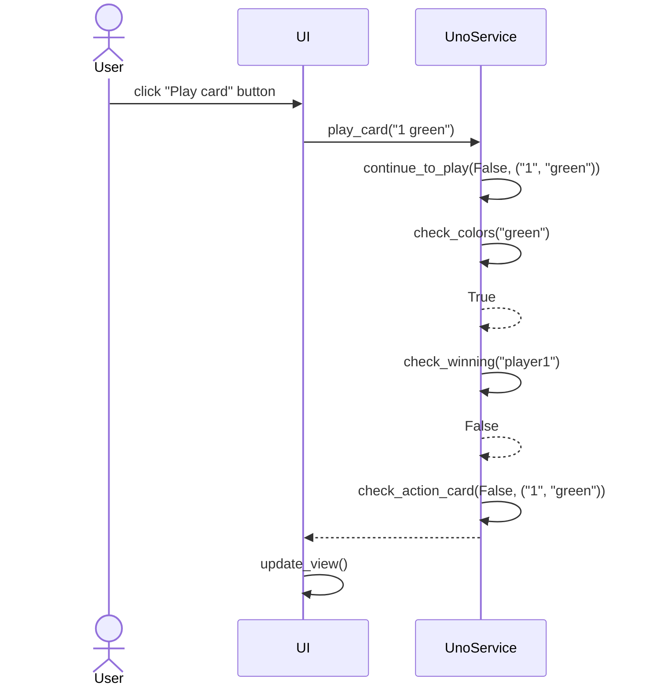
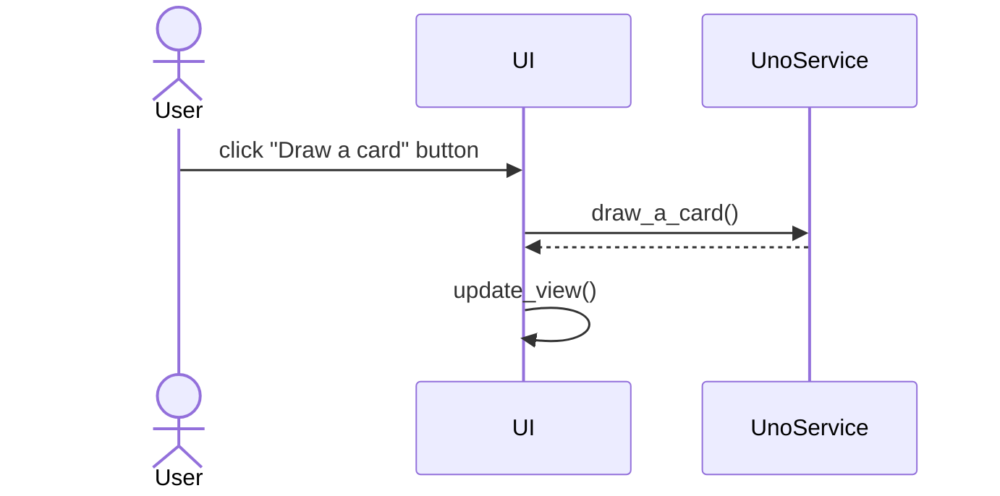
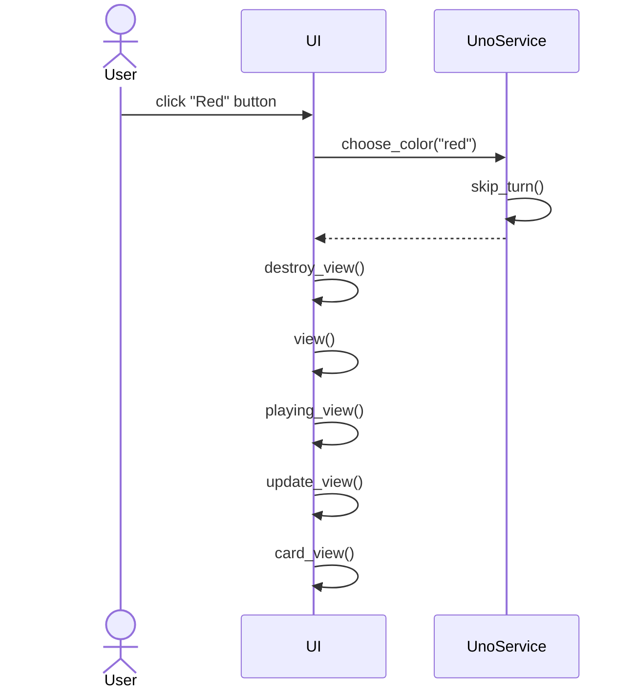

# Arkkitehtuurikuvaus

## Rakenne

Ohjelman rakenne noudattaa kolmitasoista kerrosarkkitehtuuria ja koodin pakkausrakenne on seuraava:

Ui sisältää käyttöliittymästä vastaavan koodin, services sovelluslogiikasta ja repositories tiedon tallennuksesta.

## Käyttöliittymä

Käyttöliittymä muodostuu kolmesta eri näkymästä:

- Korttien pelaaminen
- Värin valitseminen
- Voittotilastot

Yksi näkymistä on aina kerrallaan esillä. [UI](../src/ui/ui.py)-luokka huolehtii näkymän näyttämisestä ja käyttöliittymä on pyritty eristämään sovelluslogiikasta. Se kutsuu vain [UnoService](../src/service)-luokkaa.

Kun kortteja pelataan renderöi ui näkymän uudelleen pelattujen korttien mukaan, joiden tiedot on saatu sovelluslogiikalta.

## Sovelluslogiikka

Toiminnallisista kokonaisuuksista vastavat luokat UnoService ja CardsService. Luokat tarjoavat käyttöliittymän toiminnoille metodit. Näihin kuuluu:

- start_game()
- play_card(card)
- draw_a_card()
- choose_color(color)

UnoService pääsee tietojen tallennukseen käsiksi repositoriesissa sijaitsevan UnoRepositoryn kautta.

Ohjelman osien suhdetta kuvaava luokka/pakkauskaavio:

## Tietojen pysyväistallennus

Pakkauksen repositories luokka UnoRepository huolehtii tietojen tallennuksesta. Tiedot tallennetaan SQLite-tietokantaan.

Luokka noudattaa Repository-suunnittelumallia ja se on tarvittaessa mahdollista korvata uudella.

### Tiedosto

Sovelluksen juureen sijoitettu konfiguraatiotiedosto [.env](../.env) määrittää tiedoston nimen.

Tulokset tallennetaan SQLite-tietokannan tauluun Users, joka alustetaan [initialize_database.py](../src/initialize_database.py)-tiedostossa.

## Päätoiminnallisuudet

Sekvenssikaavioina kuvattu pelissä olevia toimintoja.

### Pelin aloittaminen

### Kortin pelaaminen

### Kortin nostaminen

### Värin valitseminen

