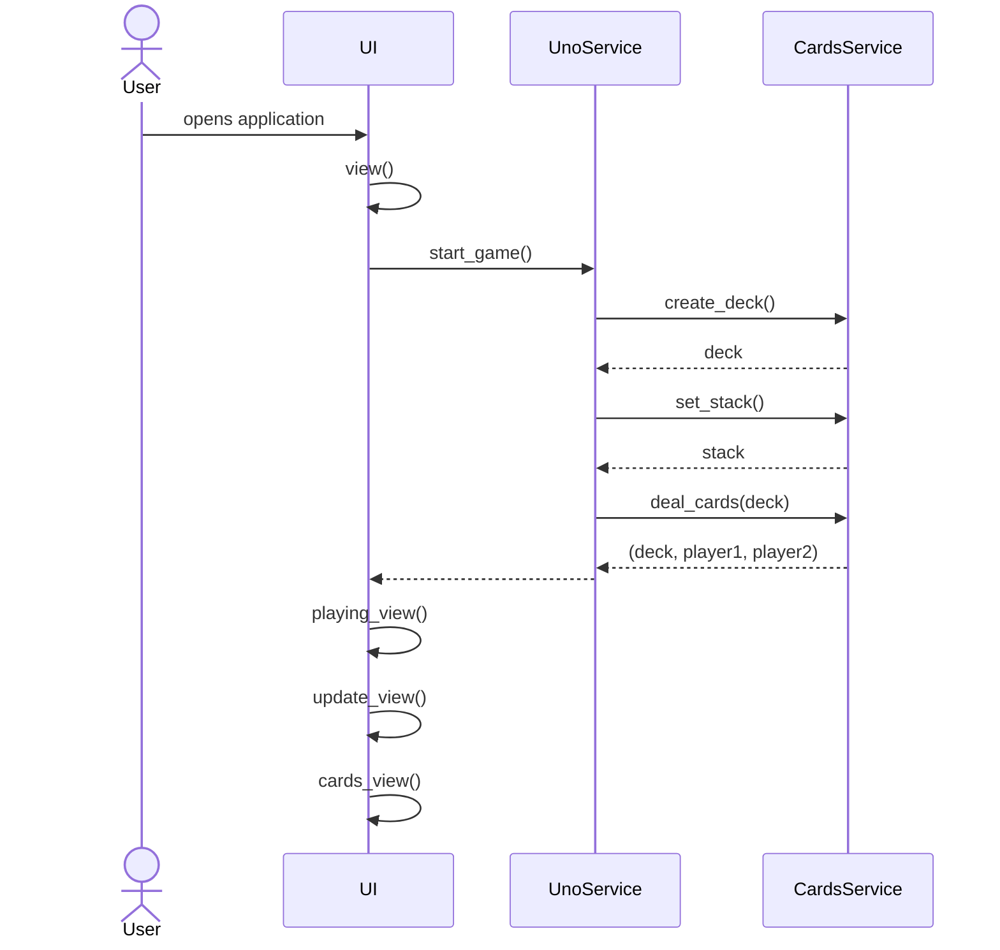
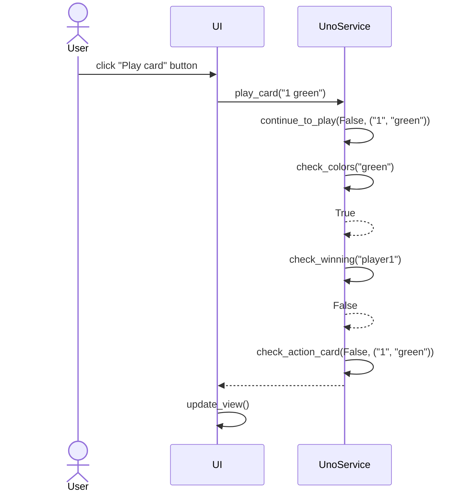
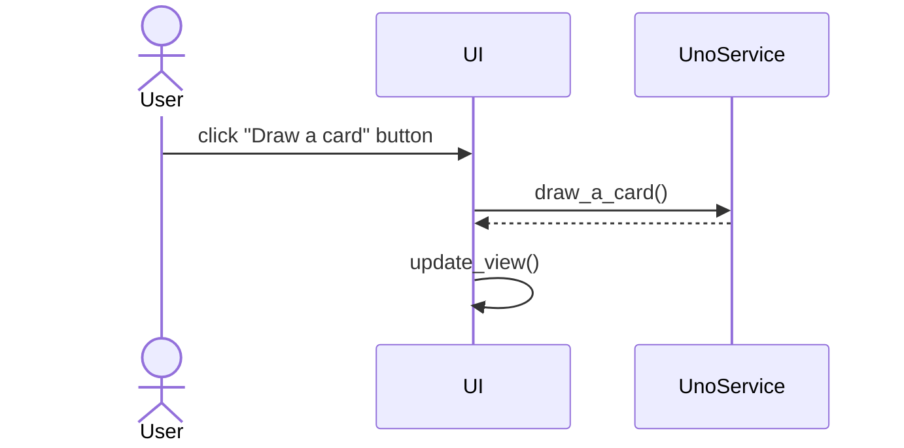
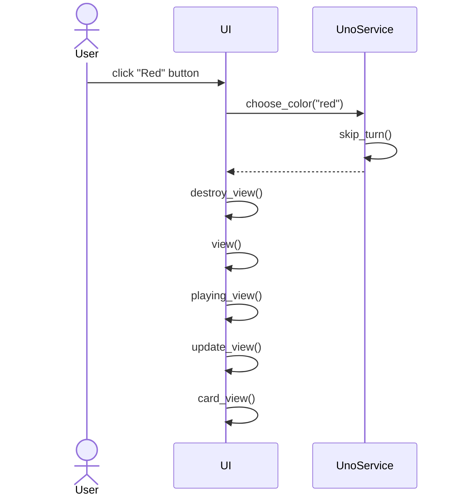

# Arkkitehtuurikuvaus

## Rakenne

Ohjelman rakenne noudattaa kolmitasoista kerrosarkkitehtuuria ja koodin pakkausrakenne on seuraava:

Ui sisältää käyttöliittymästä vastaavan koodin, services sovelluslogiikasta ja repositories tiedon tallennuksesta.

## Käyttöliittymä

Käyttöliittymä muodostuu kolmesta eri näkymästä:

- Korttien pelaaminen
- Värin valitseminen
- Voittotilastot

Yksi näkymistä on aina kerrallaan esillä. [UI](../src/ui/ui.py)-luokka huolehtii näkymän näyttämisestä ja käyttöliittymä on pyritty eristämään sovelluslogiikasta. Se kutsuu vain [UnoService](../src/services/uno_service.py)-luokkaa.

Kun kortteja pelataan renderöi ui näkymän uudelleen pelattujen korttien mukaan, joiden tiedot on saatu sovelluslogiikalta.

## Sovelluslogiikka

Toiminnallisista kokonaisuuksista vastavat luokat UnoService ja CardsService. Luokat tarjoavat käyttöliittymän toiminnoille metodit. Näihin kuuluu:

- start_game()
- play_card(card)
- draw_a_card()
- choose_color(color)

UnoService pääsee tietojen tallennukseen käsiksi repositoriesissa sijaitsevan UnoRepositoryn kautta.

Ohjelman osien suhdetta kuvaava luokka/pakkauskaavio:

## Tietojen pysyväistallennus

Pakkauksen repositories luokka UnoRepository huolehtii tietojen tallennuksesta. Tiedot tallennetaan SQLite-tietokantaan.

Luokka noudattaa Repository-suunnittelumallia ja se on tarvittaessa mahdollista korvata uudella.

### Tiedosto

Sovelluksen juureen voi halutessaan luoda konfiguraatiotiedoston _.env_ ja määrittää siellä minkä nimiseen tiedostoon tiedot tallentuu. Ohjeet tähän löytyy [käyttöohjeista](./kayttoohje.md).

Tulokset tallennetaan SQLite-tietokannan tauluun Users, joka alustetaan [initialize_database.py](../src/initialize_database.py)-tiedostossa.

## Päätoiminnallisuudet

Sekvenssikaavioina kuvattu pelissä olevia toimintoja.

### Pelin aloittaminen

Kun sovellus avataan etenee tapahtumat seuraavasti:

Käyttöliittymä kutsuu UnoService-luokan metodia start. Sovelluslogiikka huolehtii pelin alustamisen vaativista tehtävistä. Kun kaikki on valmista luo käyttöliittymä pelinäkymän.

### Kortin pelaaminen

Kun käyttäjä haluaa pelata kortin pois, valitsee hän ensin minkä kortin ja sen jälkeen painaa nappia _Play card_, etenee sovelluksen kontrolli seuraavasti:

Tapahtumankäsittelijä kutsuu sovelluslogiikan metodia play_card antaen parametriksi pelattavan kortin. Sovelluslogiikka tekee tarkistukset pystytäänkö kortti pelaamaan sekä onko kyseessä erikoiskortti. Samalla tarkastetaan onko peli voitettu. Käyttöliittymä päivittää näkymän, kun pelataan sallittu kortti ja vuorovaihtuu, jos kyseessä ei ole jokin tietty erikoiskortti.

### Kortin nostaminen

Kun käyttäjä haluaa nostaa, kortin painaa hän nappia _Draw a card_ ja sovelluksen kontrolli etenee seuraavasti:

Tapahtumankäsittelijä kutsuu sovelluslogiikan metodia draw_a_card. Sovelluslogiikka nostaa pakasta pelaajalle uuden kortin ja pakan ollessa loppunut sekoittaa kortit vielä uudelleen ennen nostoa. Käyttöliittymä päivittää näkymän seuraavan pelaajan vuoroon.

### Värin valitseminen

Kun käyttäjä haluaa valita seuraavaksi pelattavan värin klikataan värin nimistä nappia, jolloin sovelluksen kontrolli etenee seuraavasti:

Tapahtumankäsittelijä kutsuu sovelluslogiikan metodia choose_color antaen parametriksi valitun värin. Sovelluslogiikka vaihtaa värin haluttuun ja käyttöliittymä luo uuden näkymän seuraavalle pelaajalle.

### Muut toiminnallisuudet

Sama periaate toistuu muissakin toiminnallisuuksissa. Käyttöliittymä kutsuu tapahtumakäsittelijän kautta sovelluslogiikkaa, joka vastaa tarvittavan toiminnallisuuden toteuttamisesta. Tämän jälkeen käyttöliittymä tarvittaessa päivittyy.

## Ohjelman rakenteeseen jääneet heikkoudet

### Sovelluslogiikka

UnoService-luokkaan on jäänyt muutama heikkous liittyen attribuuttien liialliseen määrään ja liian moneen lausekkeeseen, joista pylint huomauttaa.
