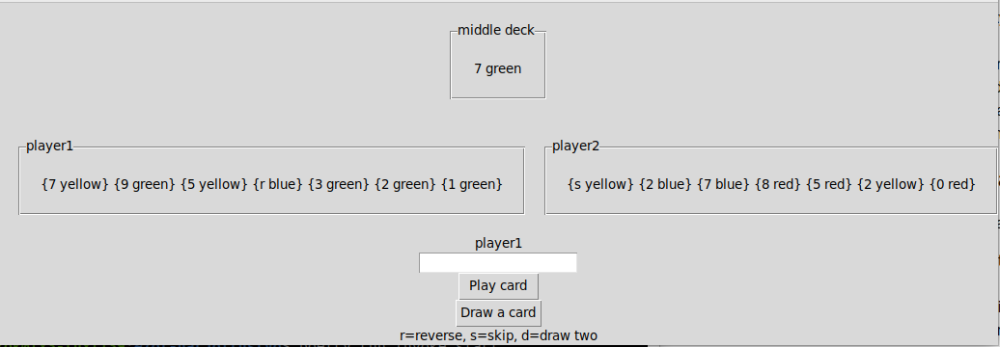
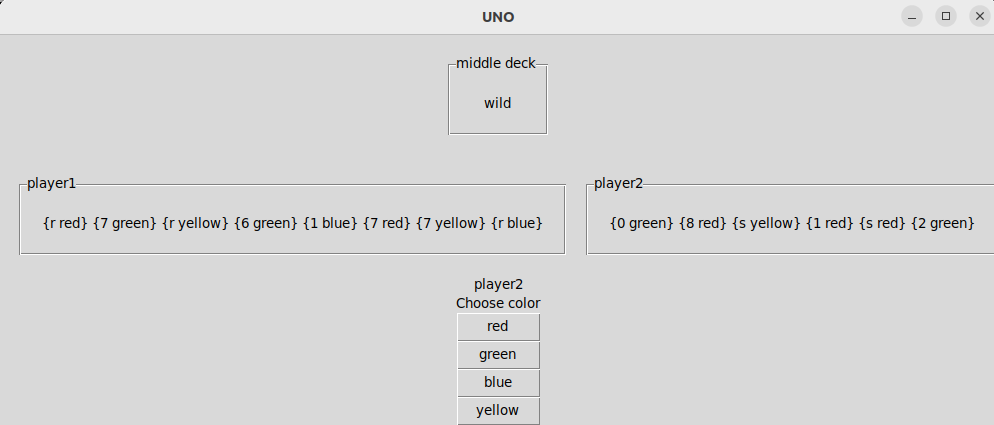

# Käyttöohje

## Pelin aloittaminen

Aloitus näkymä, joka avautuu käynnistäessä:

Ensimmäisenä näkyy korttipakka, johon kortit kuuluu pelata.

Seuraavalla rivillä näkyy kummankin pelaajan kortit.

Vastauskenttään kirjoitetaan, mikä kortti halutaan pelata ilman aaltosulkeita ja pelaajan vuoron näkee kentän yläpuolelta.

Play card nappia painamalla kortti voidaan pelata ja jos mitään korttia ei pystytä pelaamaan voi uuden kortin nostaa painamalla Draw a card nappia.

## Värin valitseminen

Villejä kortteja pelatessa pelaaja pystyy valitsemaan toisesta näkymästä värin:

Värin pystyy valitsemaan painamalla haluttua väriä, jonka jälkeen näkymä palaa takaisin aloituksesta tuttuun.
