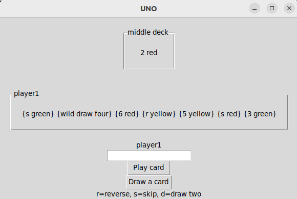
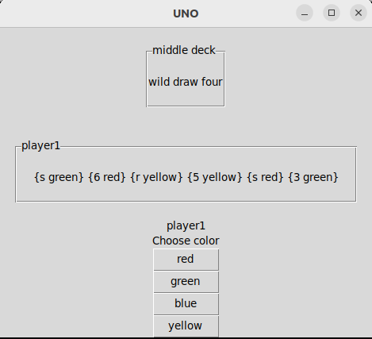

# Käyttöohje

Projektin saa käyttöön lataamalla sen lähdekoodi viimeisimmän [releasen](https://github.com/pinjakokkonen/ot-harjoitustyo/releases/tag/loppupalautus) kohdasta _Source code_, joka löytyy _Assets_-osion alta.

## Konfigurointi

Jos tallennukseen osallistuvan tiedoston nimeä haluaa konfiguroida, onnistuu se _.env_-tiedostossa. Tiedostot luodaan hakemistoon _data_ ja _.env_-tiedoston sisältö näyttää seuraavalta:

```
DATABASE_FILENAME=database.sqlite
```

## Ohjelman käynnistäminen

Ensimmäisenä asenna riippuvuudet komennolla:

```bash
poetry install
```

Seuraavaksi alusta tietokanta komennolla:

```bash
poetry run invoke build
```

Lopulta voit käynnistää ohjelman komennolla:

```
poetry run invoke start
```

## Pelin aloittaminen

Aloitus näkymä, joka avautuu käynnistäessä:



Ensimmäisenä näkyy korttipakka, johon kortit kuuluu pelata.

Seuraavalla rivillä näkyy pelaajan kortit.

Vastauskenttään kirjoitetaan, mikä kortti halutaan pelata ilman aaltosulkeita ja pelaajan vuoron näkee kentän yläpuolelta.

Play card nappia painamalla kortti voidaan pelata ja jos mitään korttia ei pystytä pelaamaan voi uuden kortin nostaa painamalla Draw a card nappia.

## Värin valitseminen

Villejä kortteja pelatessa pelaaja pystyy valitsemaan toisesta näkymästä värin:



Värin pystyy valitsemaan painamalla haluttua väriä, jonka jälkeen näkymä palaa takaisin aloituksesta tuttuun.

## Uuden pelin aloitus

Pelin päättyessä näkyy tilasto, josta pääsee aloittamaan uuden pelin:


Näytöllä näkyy ensin pelaajan 1 voitot ja sen alla pelaajan 2 voitot.

Play again nappia painamalla pystyy aloittamaan uuden pelin.
