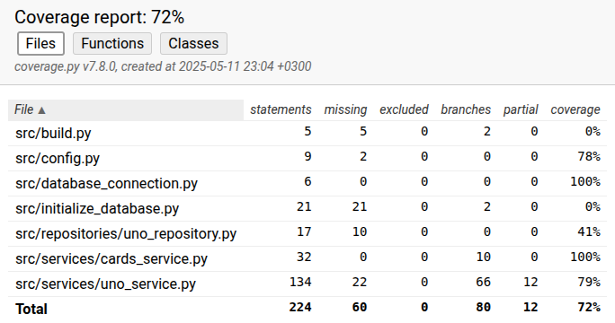

# Testausdokumentti

Ohjelmaa on testattu automatiosoiduilla unittesteillä yksikkö- ja integraatiotasolla sekä manuaalisesti järjestelmätestauksella.

## Yksikkö- ja integraatiotestaus

### Sovelluslogiikka

Sovelluslogiikkaa testaavat luokat TestUnoService ja TestCardsService.

### Testauskattavuus

Käyttöliittymää huomioimatta sovelluksen haarautumakattavuus on 72%

## Järjestelmätestaus

Järjestelmätestaus on toteutettu manuaalisesti.

### Asennus ja konfigurointi

Sovellus on kokeiltu ladata ja testattu Linux-ympäristössä [käyttöohjeen](./kayttoohje.md) mukaan. Testauksessa on myös kokeiltu eri konfiguraatioita _.env_-tiedoston avulla.

### Toiminnallisuudet

Vaatimusmäärittelyn ja käyttöohjeen toiminnallisuudet testattu. On pyritty antamaan virheellisiä syötteitä ja testaamaan toimivuus niissäkin tilanteissa.

## Sovellukseen jääneet laatuongelmat

Sovellus ei anna tällä hetkellä virheilmoitusta seuraavassa tilanteessa:
- Jos tietokantaa ei alusta komennolla poetry run invoke build, ei tästä tule ilmoitusta
