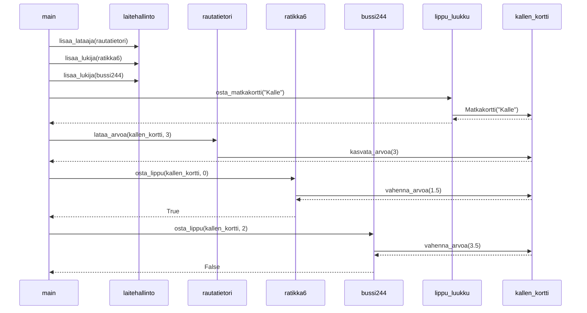

```mermaid
sequenceDiagram
    participant main
    participant laitehallinto
    participant rautatietori
    participant ratikka6
    participant bussi244
    participant lippu_luukku
    participant kallen_kortti

    main->>laitehallinto: lisaa_lataaja(rautatietori)
    
    main->>laitehallinto: lisaa_lukija(ratikka6)

    main->>laitehallinto: lisaa_lukija(bussi244)

    main->>lippu_luukku: osta_matkakortti("Kalle")
    lippu_luukku->>kallen_kortti: Matkakortti("Kalle")
    kallen_kortti-->>lippu_luukku: 
    lippu_luukku-->>main: 

    main->>rautatietori: lataa_arvoa(kallen_kortti, 3)
    rautatietori->>kallen_kortti: kasvata_arvoa(3)
    kallen_kortti-->>main: 

    main->>ratikka6: osta_lippu(kallen_kortti, 0)
    ratikka6->>kallen_kortti: vahenna_arvoa(1.5)
    kallen_kortti-->>ratikka6: 
    ratikka6-->>main: True

    main->>bussi244: osta_lippu(kallen_kortti, 2)
    bussi244->>kallen_kortti: vahenna_arvoa(3.5)
    kallen_kortti-->>bussi244: 
    bussi244-->>main: False
```
